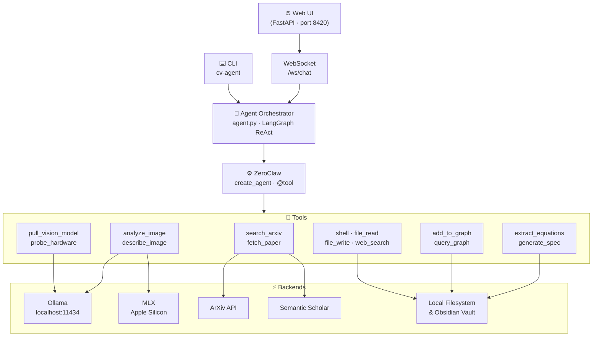
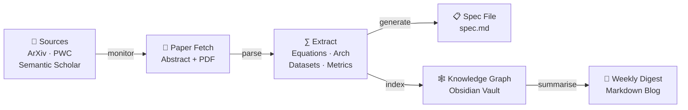
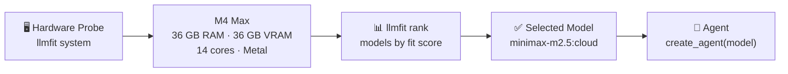
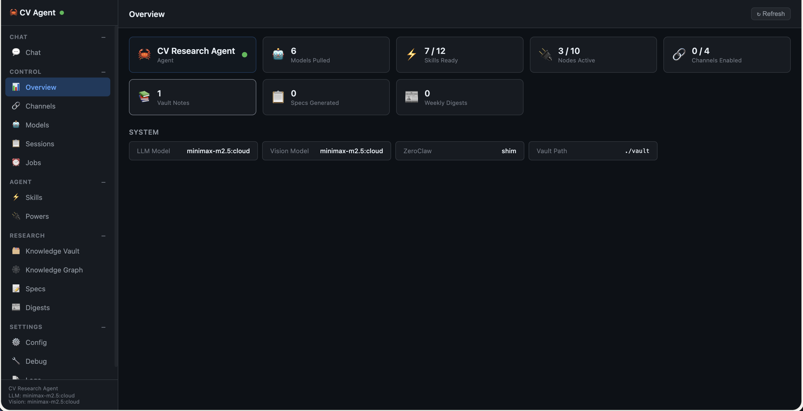
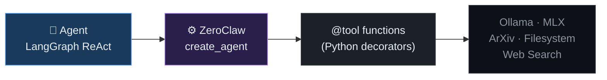

# Computer Vision Assistant 👁️

An autonomous Computer Vision research assistant — monitors arXiv, processes papers, builds knowledge graphs, generates specs, and runs vision tasks locally via Ollama and MLX. Powered by [ZeroClaw](https://github.com/zeroclaw-labs/zeroclaw).

---

## Architecture



---

## Research → Knowledge Pipeline



---

## Hardware-Aware Model Selection



---

## Web UI

Single-page app at `http://localhost:8420` using a sidebar layout inspired by OpenClaw.



---

## Concepts

### 🤖 Models
Model weights that power intelligent inference. Three categories live in this project:

| Type | Where | Examples |
|------|-------|---------|
| **Ollama models** | Pulled via `ollama pull` | qwen2.5vl, qwen3-vl, olmocr2 (VLMs / LLMs) |
| **Local HF models** | Downloaded to `output/.models/` | SD-Turbo, SAM 2/3, Monkey OCR 1.5, SVD |
| **pip-based models** | Auto-download on first use | PaddleOCR |

Models are managed from the **Models** view — pull Ollama models, download HuggingFace weights, track disk usage, and monitor health of local inference servers.

---

### ⚡ Skills
A **Skill** is a named, composable capability built from one or more of:

- **Models** — AI/ML weights that provide intelligence (e.g. SAM 3 for segmentation, SD-Turbo for generation)
- **Algorithms** — Classical CV methods (e.g. feature matching for stitching, RANSAC, optical flow)
- **Open-source libraries** — MIT / Apache 2.0 / BSD-3 only (e.g. `kornia`, `diffusers`, `supervision`, `torchvision`)
- **Powers** *(optional)* — External integrations needed for some skills (e.g. HuggingFace token, Email SMTP)

Skills show three states in the UI:

| Badge | Meaning |
|-------|---------|
| ✅ **Ready** | All dependencies and powers present — skill is fully operational |
| 📦 **Needs Install** | Missing a Python package — shown with `pip install …` command |
| ⚡ **Needs Power** | Requires an external integration or API key to be configured |

**Current skill catalogue:**

| Icon | Skill | Category | Powered By | Status |
|------|-------|----------|-----------|--------|
| 🖼️ | 2D Image Processing | Vision | Pillow · OpenCV (Apache 2.0) | ✅ Ready |
| 🧊 | 3D Image Processing | Vision | open3d · trimesh (MIT/Apache) | 📦 `pip install open3d` |
| 🎥 | Video Understanding | Vision | opencv-python · decord (Apache 2.0) | 📦 `pip install opencv-python` |
| 🧩 | Image Stitching | Vision | OpenCV Stitcher (Apache 2.0) | 📦 `pip install opencv-python` |
| 🎯 | Object Detection | Vision | torchvision (BSD-3) · transformers RT-DETR (Apache 2.0) | 📦 `pip install torchvision` |
| 📡 | Object Tracking | Vision | supervision + ByteTrack/SORT (MIT) | 📦 `pip install supervision` |
| 🖼️ | Text → Image | Vision | diffusers (Apache 2.0) + SD-Turbo / SDXL-Turbo models | 📦 `pip install diffusers` |
| 🔭 | Super Resolution | Vision | spandrel (MIT) — ESRGAN · SwinIR · HAT | 📦 `pip install spandrel` |
| ✨ | Image Denoising | Vision | kornia (Apache 2.0) — Gaussian · bilateral · NLM | 📦 `pip install kornia` |
| 📄 | Image Document Extraction | Vision | Monkey OCR 1.5 (default) · PaddleOCR fallback | ✅ Ready (Monkey OCR downloaded) |
| ✍️ | Write Research Blog | Content | search_arxiv · web_search · file_write | ✅ Ready |
| 📰 | Weekly Digest | Content | search_arxiv · web_search · file_write | ✅ Ready |
| 📧 | Email Reports | Content | SMTP | ⚡ Needs Power (Email) |
| 📋 | Paper → Spec | Research | fetch_arxiv_paper · extract_equations | ✅ Ready |
| 🕸️ | Knowledge Graph | Research | Obsidian vault · graph.py | ✅ Ready |
| ∑ | Equation Extraction | Research | LaTeX parser · PDF tools | ✅ Ready |
| 🧭 | Text → Diagram | Research | paperbanana · Ollama · matplotlib | 📦 `pip install -e paperbanana/` |
| 🏆 | Kaggle Competition | ML / Training | Kaggle API | ⚡ Needs Power (Kaggle) |
| 🎯 | Model Fine-Tuning | ML / Training | HuggingFace Trainer · Azure ML | ⚡ Needs Power (HF / Azure) |
| 📊 | Dataset Analysis | ML / Training | shell · file_read · analyze_image | ✅ Ready |

**6 / 20 skills ready** out of the box. Install packages or configure Powers to unlock the rest.

---

### 🔌 Powers
A **Power** is an external resource, integration, or API key that extends what the agent can access. Powers are configured from the **Powers** view — no manual `.env` editing required.

---

## Agents

Agents are standalone, focused AI workers — each with its own system prompt, curated tool set, and dedicated WebSocket endpoint (`/ws/agent/<id>`). They can also be invoked by the main agent via delegation tools.

| Icon | Agent | Description | Status |
|------|-------|-------------|--------|
| ✍️ | **Blog Writer** | Writes research blog posts from papers, summaries, or topics. Fetches live paper data before writing. | ✅ Ready |
| 🌐 | **Website Maintenance** | Audits sites for broken links, uptime, and on-page SEO issues. | ✅ Ready |
| 🏋️ | **Model Training** | Generates training configs, cost estimates, and full training scripts for any CV model/task. | ✅ Ready |
| 📊 | **Data Visualization** | Generates matplotlib/plotly chart code and extracts metrics tables from papers. | ✅ Ready |
| 📄→💻 | **Paper to Code** | Scaffolds complete PyTorch implementations from ArXiv papers — model, training loop, dataset class. | ✅ Ready |

Each agent is accessible via:
- **Web UI** — select the agent from the sidebar
- **WebSocket** — `ws://localhost:8420/ws/agent/<id>` (e.g. `blog_writer`, `paper_to_code`)
- **REST** — `GET /api/agents` lists all agents; `GET /api/agents/<id>` returns agent details
- **Main agent delegation** — the main agent auto-delegates tasks using `delegate_<agent>` tools

Per-agent model overrides: set `BLOG_WRITER_MODEL`, `WEBSITE_AGENT_MODEL`, `TRAINING_AGENT_MODEL`, `VIZ_AGENT_MODEL`, or `PAPER_TO_CODE_MODEL` in `.env` to use a different model for a specific agent.

---

## Powers

### 🔌 Built-in (always available)

| Icon | Power | Status | Notes |
|------|-------|--------|-------|
| 🔍 | Internet Search | ✅ Active | DuckDuckGo by default; set `BRAVE_API_KEY` for higher quality |
| 📁 | Local File System | ✅ Active | `file_read`, `file_write`, `shell` via ZeroClaw |
| 📚 | ArXiv | ✅ Active | Free public API — no key required |
| 🔬 | Semantic Scholar | ⚠️ Limited | Rate-limited; set `SEMANTIC_SCHOLAR_API_KEY` for full access |
| 🖼️ | 2D Image Processing | ✅ Active | Pillow + OpenCV; unlocks Object Detection, Tracking, Segmentation skills |
| 🧊 | 3D Image Processing | 📦 Install | Requires `open3d`; `pip install open3d` |

### 🔗 Integrations (configure in Powers view)

| Icon | Power | Status | Env Var |
|------|-------|--------|---------|
| 📧 | Email (SMTP) | Inactive | `SMTP_HOST`, `SMTP_USER`, `SMTP_PASSWORD` |
| 🤗 | HuggingFace Hub | Inactive | `HF_TOKEN` |
| 🏆 | Kaggle | Inactive | `KAGGLE_USERNAME`, `KAGGLE_KEY` |
| 🐙 | GitHub | Inactive | `GITHUB_TOKEN` |
| 🔤 | OCR | Inactive | `OCR_ENGINE` (`tesseract`, `easyocr`, or `monkeyocr`); unlocks Document Text Extraction skill |
| 🎬 | Vid-LLMs | Inactive | `VID_LLM_MODEL` (e.g. `video-llava`, `internvl2`); unlocks Video Understanding skill |

### ☁️ Cloud Compute

| Icon | Power | Status | Env Var |
|------|-------|--------|---------|
| ☁️ | Azure ML | Inactive | `AZURE_SUBSCRIPTION_ID`, `AZURE_ML_WORKSPACE` |
| 🚀 | RunPod | Inactive | `RUNPOD_API_KEY` |

All powers are configurable directly from the **Powers** view in the UI — no manual `.env` editing required.

---

## ZeroClaw Integration

ZeroClaw is the **tool execution layer** between the agent orchestrator and CV tools.



**Current status:** `zeroclaw-tools` is not yet on PyPI. A local shim at `src/zeroclaw_tools/__init__.py` provides the identical API surface via LangChain + LangGraph. When the package ships:

```bash
pip install zeroclaw-tools
rm -rf src/zeroclaw_tools/   # zero other changes required
```

---

## Quick Start

### Prerequisites

- Python 3.12+
- [Ollama](https://ollama.ai) running locally
- macOS Apple Silicon recommended (Metal acceleration via MLX)
- [llmfit](https://github.com/AlexsJones/llmfit) for hardware detection: `brew install llmfit`

### Setup

```bash
git clone https://github.com/kp-algomaster/ComputerVision-Assistant
cd ComputerVision-Assistant

python -m venv .venv
source .venv/bin/activate

# Install the agent + ZeroClaw shim dependencies (LangChain, LangGraph, etc.)
pip install -e ".[dev]"

# Optional: install ZeroClaw when it ships on PyPI (shim is used until then)
# pip install zeroclaw-tools

cp .env.example .env   # add API keys
```

> **ZeroClaw shim:** `zeroclaw-tools` is not yet on PyPI. The repo ships a local compatibility shim at `src/zeroclaw_tools/` that provides the identical `@tool` / `create_agent` API via LangChain + LangGraph. `pip install -e ".[dev]"` installs all shim dependencies automatically. Once the real package is published, replace it with `pip install zeroclaw-tools` and delete the `src/zeroclaw_tools/` directory — no other changes needed.

### Launch

```bash
# Web UI — chat + model management + skills/powers dashboard
source .venv/bin/activate
cv-agent ui
# → http://127.0.0.1:8420

# Or start directly with uvicorn
uvicorn cv_agent.web:create_app --factory --host 127.0.0.1 --port 8420 --app-dir src
```

### CLI Commands

```bash
cv-agent start                                     # interactive terminal agent
cv-agent paper https://arxiv.org/abs/2312.00785 --spec  # process a paper
cv-agent digest --week                             # generate weekly digest
cv-agent vision analyze path/to/image.png          # analyse an image
cv-agent knowledge sync                            # sync knowledge graph
```

---

## Project Structure

```
CV_Zero_Claw_Agent/
├── src/
│   ├── cv_agent/
│   │   ├── agent.py              # Agent orchestrator + LangGraph ReAct loop
│   │   ├── cli.py                # Click CLI entry point
│   │   ├── web.py                # FastAPI server + all API endpoints
│   │   ├── config.py             # Pydantic config (AgentConfig, LlmfitConfig)
│   │   ├── ui/
│   │   │   ├── index.html        # 15-view SPA shell
│   │   │   ├── style.css         # Dark theme (GitHub-inspired)
│   │   │   └── app.js            # View routing, chat WS, all loaders
│   │   ├── tools/
│   │   │   ├── vision.py         # Ollama vision tools
│   │   │   ├── mlx_vision.py     # MLX-accelerated vision (Apple Silicon)
│   │   │   ├── paper_fetch.py    # ArXiv / paper fetching
│   │   │   ├── equation_extract.py   # LaTeX equation extraction
│   │   │   ├── knowledge_graph.py    # Obsidian knowledge graph
│   │   │   ├── spec_generator.py     # Paper → spec.md pipeline
│   │   │   ├── hardware_probe.py     # llmfit integration + Ollama management
│   │   │   └── remote.py             # Telegram / Discord / messaging
│   │   ├── research/
│   │   │   ├── monitor.py        # Source monitoring scheduler
│   │   │   ├── digest.py         # Weekly digest generator
│   │   │   └── sources.py        # ArXiv / PWC / Semantic Scholar config
│   │   └── knowledge/
│   │       ├── graph.py          # Graph core logic
│   │       └── obsidian.py       # Obsidian vault writer
│   └── zeroclaw_tools/
│       └── __init__.py           # ZeroClaw shim (delete when PyPI pkg ships)
├── config/
│   └── agent_config.yaml         # Full agent configuration
├── vault/                        # Obsidian knowledge vault output
├── output/                       # Generated specs and digests
└── .env                          # Secrets (gitignored)
```

---

## Configuration

### Environment Variables (`.env`)

| Variable | Default | Description |
|----------|---------|-------------|
| `OLLAMA_HOST` | `http://localhost:11434` | Ollama server URL |
| `LLM_MODEL` | `minimax-m2.5:cloud` | LLM model tag |
| `OLLAMA_VISION_MODEL` | `minimax-m2.5:cloud` | Vision model tag |
| `LLM_BASE_URL` | `http://localhost:11434/v1` | OpenAI-compatible base URL |
| `BRAVE_API_KEY` | — | Brave Search (upgrades web search quality) |
| `SEMANTIC_SCHOLAR_API_KEY` | — | Removes rate limits on paper search |
| `HF_TOKEN` | — | HuggingFace Hub access |
| `KAGGLE_USERNAME` / `KAGGLE_KEY` | — | Kaggle competition tools |
| `GITHUB_TOKEN` | — | GitHub repo access |
| `SMTP_HOST` / `SMTP_USER` / `SMTP_PASSWORD` | — | Email power |
| `VAULT_PATH` | `./vault` | Obsidian vault output path |

Full configuration reference: [`config/agent_config.yaml`](config/agent_config.yaml)

---

## License

This project is licensed under the **MIT License** — see the [LICENSE](LICENSE) file for full terms.

```
MIT License  Copyright (c) 2026 kp-algomaster
```

You are free to use, modify, and distribute this software for any purpose, including commercial use, with no warranty. Attribution appreciated but not required.

### Third-party notices

| Dependency | License |
|------------|---------|
| [LangChain](https://github.com/langchain-ai/langchain) | MIT |
| [LangGraph](https://github.com/langchain-ai/langgraph) | MIT |
| [FastAPI](https://github.com/tiangolo/fastapi) | MIT |
| [Ollama](https://github.com/ollama/ollama) | MIT |
| [llmfit](https://github.com/AlexsJones/llmfit) | Apache 2.0 |
| [MLX](https://github.com/ml-explore/mlx) | MIT |
| [Pydantic](https://github.com/pydantic/pydantic) | MIT |

> **Model licenses** vary by provider. `minimax-m2.5:cloud` and other Ollama-served models are subject to their own upstream licenses. Check the model card on [Ollama Hub](https://ollama.com/library) before commercial use.
